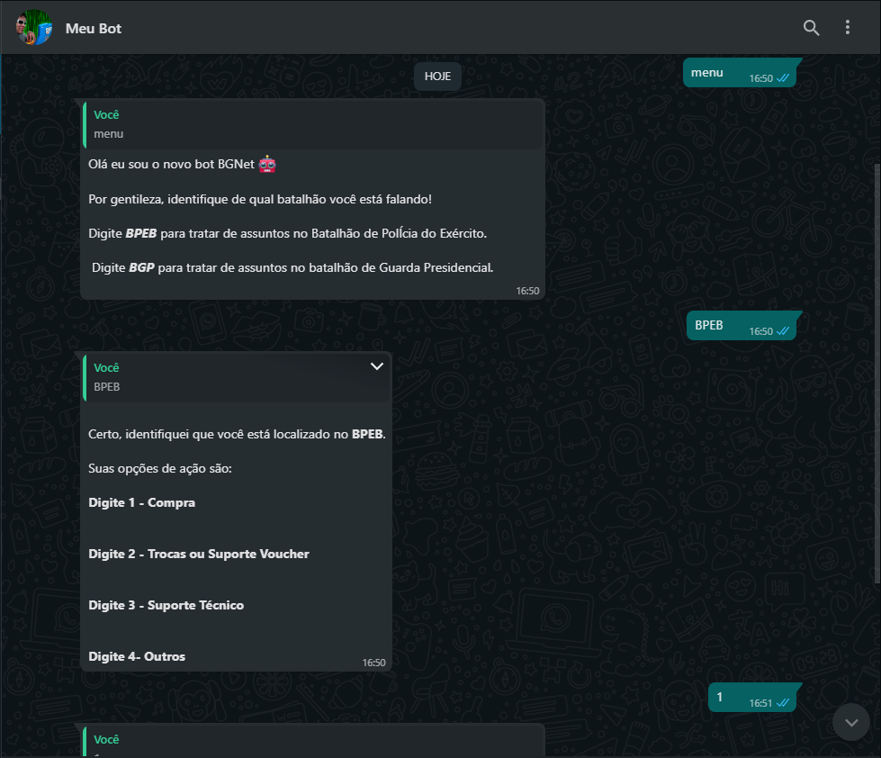
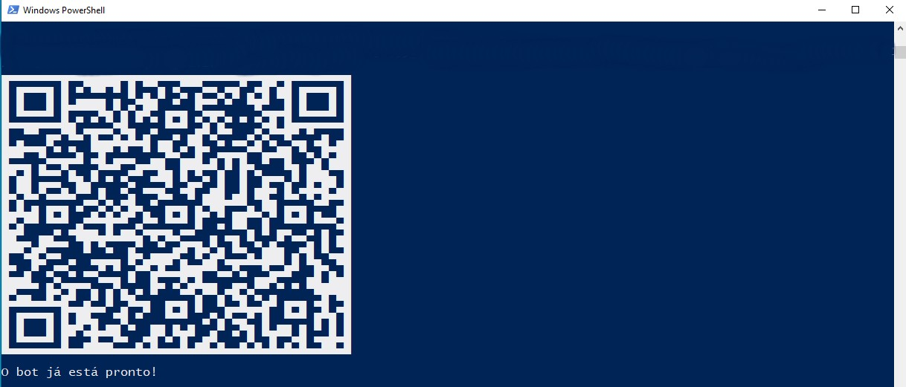

# BOT_BGNET
<p align="center">
  
  
  <br/>
</p>

### Instalando o projeto

**Clone este Repositorio**

```
$ git clone https://github.com/LucasMSCaetano/BOT_BGNET.git

$ cd BOT_BGNET
```

**Instale as dependências**

```
$ yarn
```

_ou_

```
$ npm install
```

**Agora basta executar o comando**

```
$ node index.js
```
